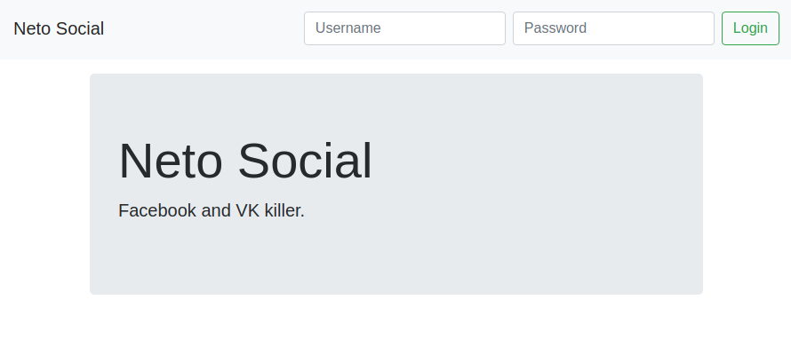

Authentication
===

Вы решили модернизировать систему с аутентификацией, используя знания, полученные о роутере.

Используя сервер, расположенный в каталоге `backend`, реализуйте приложение, удовлетворяющее следующим условиям:

1. При первой загрузке показывается лэндинг с формой входа (url = /):



2. После авторизации (POST http://localhost:7070/auth `{"username": "vasya", "password": "vasya"}`), загружаются компоненты ленты новостей и в тулбаре отображается профиль с кнопкой выйти (url = /news):


Для запроса профиля используйте запрос вида:
```
GET http://localhost:7070/private/me
Authorization: Bearer <ваш_токен>
```

Для запроса новостей используйте запрос вида:
```
GET http://localhost:7070/private/news
Authorization: Bearer <ваш_токен>
```

3. При нажатии на кнопку «Выйти» URL происходит редирект на главную страницу (url = /).

4. Каждая новость кликабельна, при клике на новость открывается страница, на которой показана только карточка этой новости (url = /news/{id}). 

5. Если пользователь не аутентифицирован, то попытка зайти на /news или /news/{id} должна приводить к редиректу на главную страницу (url = /).

Важно:
1. Профиль и токен должны храниться в localStorage/sessionStorage. При перезагрузке страницы должна также загружаться лента новостей, если мы аутентифицированы)
1. Должна быть обработка ошибок, если получена ошибка 401, то нужно разлогинивать пользователя и удалять всё из localStorage/sessionStorage.
1. Должна быть обработка ошибок, если получена ошибка 404, например, пользователь в аутентифицированном режиме вручную вбил в адресную строку /news/00000000-0000-0000-0000-000000000000, то должна отрисовываться страница 404 — просто тулбар + большими буквами Not Found. Например, как на GitHub:


